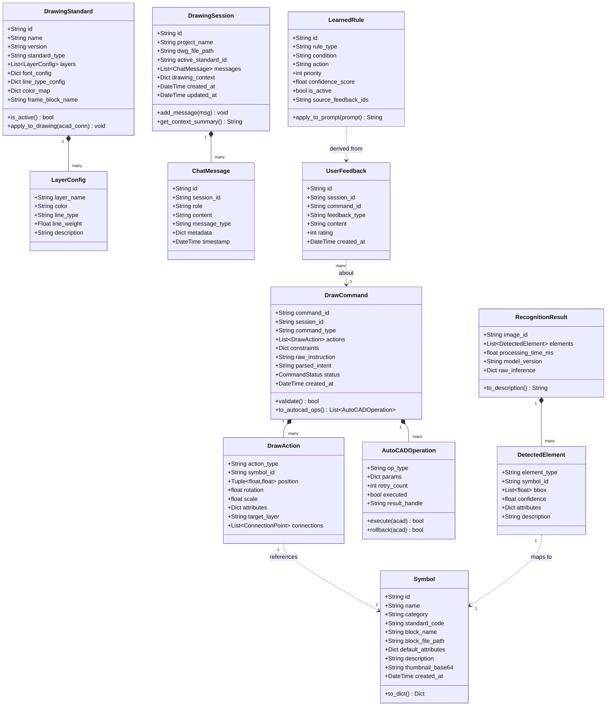
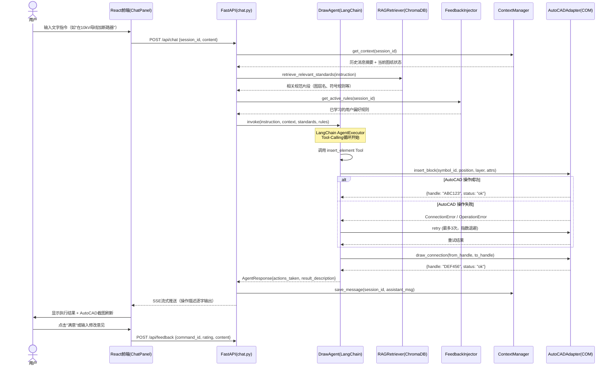
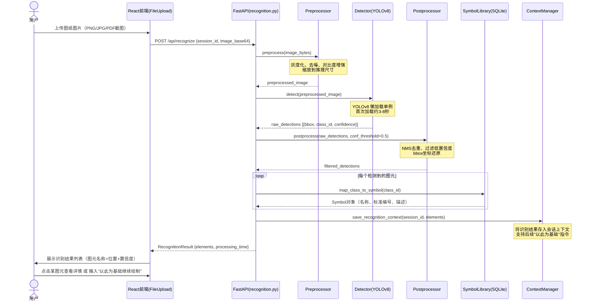
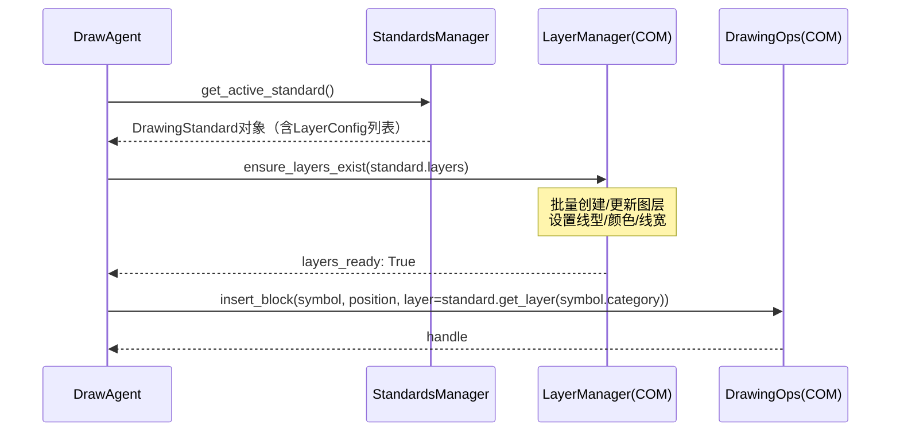
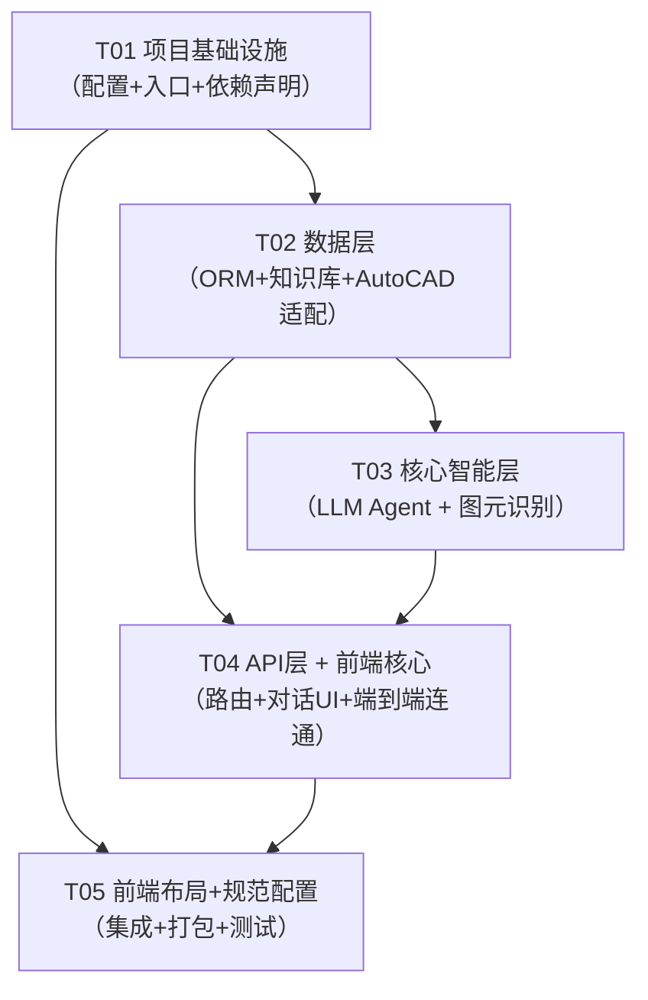

# 电气图纸绘制机器人 — 系统架构设计文档

**文档版本**：v1.0  
**作者**：高见远（架构师）  
**日期**：2025-05-21  
**关联 PRD**：docs/PRD.md v1.0

---

## Part A：系统设计

---

### 1. 技术选型与实现方案

#### 1.1 核心技术挑战

| # | 挑战 | 难点描述 |
|---|------|----------|
| C1 | AutoCAD COM 稳定性 | COM/ActiveX 接口依赖进程状态，AutoCAD 崩溃或重启后连接断裂；绘图操作需要事务控制 |
| C2 | LLM 指令映射精度 | 自然语言到图元操作指令的映射存在歧义，需结合 Few-Shot 提示工程和工具调用（Function Call） |
| C3 | 图元识别模型冷启动 | 本地 CV 模型加载耗时 3~10 秒，影响首次体验；电气符号种类多、图纸背景复杂 |
| C4 | 前后端通信架构 | Electron 前端与 Python 后端需要高效的 IPC 或本地 HTTP 通信方案 |
| C5 | 上下文多轮管理 | 同一绘图会话中需要追踪图纸状态、已插入图元、用户意图链 |

#### 1.2 技术选型

##### 前端层（桌面应用）

| 技术 | 版本 | 选型理由 |
|------|------|----------|
| **Electron** | ^30.x | 跨 Chromium + Node.js 的桌面壳，能直接调用本地文件系统、与 Python 后端 IPC 通信；是 Windows 桌面 + Web 技术栈的最成熟方案 |
| **React** | ^18.2 | 组件化 UI，生态丰富，配合 Vite 开发体验好 |
| **Vite** | ^5.x | 极快 HMR，Electron 场景下也支持 main/renderer 双进程开发 |
| **Tailwind CSS** | ^3.4 | 原子类，快速布局；避免过重的 UI 库依赖 |
| **shadcn/ui + Radix UI** | latest | 无障碍基础组件，风格干净，配合 Tailwind 定制性强 |
| **Zustand** | ^4.x | 轻量状态管理，适合中等规模前端状态（对话历史、会话上下文、连接状态） |
| **React Query (TanStack)** | ^5.x | 管理与后端 HTTP API 的异步状态，缓存、重试策略内置 |

##### 后端层（Python 服务）

| 技术 | 版本 | 选型理由 |
|------|------|----------|
| **FastAPI** | ^0.111 | 异步 HTTP 框架，自动生成 OpenAPI 文档；与 Electron 渲染进程通过 localhost HTTP 通信 |
| **pyautocad + pywin32** | latest | pyautocad 封装 AutoCAD COM 对象，pywin32 提供底层 win32com.client 支撑；是 Python 操作 AutoCAD 的标准方案 |
| **LangChain** | ^0.2 | LLM 编排框架，内置 Tool-Call/Function-Call、多轮 Memory、RAG Chain；避免手写 LLM 流程 |
| **OpenAI SDK / httpx** | latest | 支持 GPT-4o 及兼容 OpenAI 协议的通义千问、混元等国内 LLM |
| **ChromaDB** | ^0.5 | 轻量本地向量数据库，支持持久化；用于图元规范 RAG 检索和用户偏好存储 |
| **Ultralytics (YOLOv8)** | ^8.x | 图元识别首选，支持自定义训练、ONNX 导出、本地推理；电气符号检测任务成熟 |
| **faster-whisper** | ^1.x | 本地 Whisper 推理（P1 语音），CPU/GPU 均可，比 openai-whisper 快 4x |
| **SQLite + SQLAlchemy** | latest | 本地轻量关系数据库，存储会话历史、图纸元数据、规范配置；无需独立数据库服务 |
| **Pydantic v2** | ^2.7 | 数据验证与序列化，所有模型定义统一使用；LangChain 原生支持 |
| **loguru** | ^0.7 | 结构化日志，自动轮转，替代标准 logging |

##### 通信协议

| 通道 | 协议 | 说明 |
|------|------|------|
| Electron 渲染 ↔ Python 后端 | HTTP/SSE (localhost:8765) | REST API + Server-Sent Events 流式输出 |
| Electron main ↔ renderer | contextBridge IPC | 安全隔离的 Electron IPC |
| Python 后端 ↔ AutoCAD | COM/ActiveX | win32com.client.Dispatch("AutoCAD.Application") |
| Python 后端 ↔ LLM | HTTPS REST | OpenAI-compatible API |

#### 1.3 架构模式

- **整体**：分层架构（Presentation → Application → Domain → Infrastructure）
- **前端**：MVVM（Zustand store 作为 ViewModel）
- **后端**：Clean Architecture + 六边形架构（核心领域与基础设施解耦）
- **LLM 流程**：Tool-Calling Agent（LangChain AgentExecutor，AutoCAD 操作封装为 Tool）

---

### 2. 模块划分

```
┌──────────────────────────────────────────────────────────────────────┐
│                         Electron 前端（renderer）                      │
│  ┌─────────────┐  ┌──────────────┐  ┌────────────┐  ┌─────────────┐ │
│  │  对话交互    │  │  AutoCAD预览  │  │  规范配置   │  │  图元库管理  │ │
│  │  (Chat UI)  │  │  (Preview)   │  │  (Config)  │  │  (Symbol)   │ │
│  └─────────────┘  └──────────────┘  └────────────┘  └─────────────┘ │
└────────────────────────────────┬─────────────────────────────────────┘
                                 │ HTTP/SSE localhost:8765
┌────────────────────────────────▼─────────────────────────────────────┐
│                        FastAPI 后端                                    │
│  ┌──────────────────────────────────────────────────────────────────┐ │
│  │  M1: API Gateway层（路由 / 认证 / 错误处理 / 流式响应）              │ │
│  └────────────────────┬─────────────────────────────────────────────┘ │
│  ┌─────────────────────▼────────────────────────────────────────────┐ │
│  │  M2: 指令解析引擎（LLM Agent + Tool Registry + 上下文管理）         │ │
│  └──────────┬──────────────────────────────────┬────────────────────┘ │
│  ┌──────────▼──────────┐           ┌───────────▼────────────────────┐ │
│  │  M3: 图元识别模块     │           │  M4: 规范与知识库模块           │ │
│  │  (CV/YOLOv8推理)    │           │  (ChromaDB RAG + SQLite规范)   │ │
│  └─────────────────────┘           └────────────────────────────────┘ │
│  ┌──────────────────────────────────────────────────────────────────┐ │
│  │  M5: AutoCAD 适配层（COM封装 / 事务管理 / 重试机制）                 │ │
│  └──────────────────────────────────────────────────────────────────┘ │
│  ┌──────────────────────────────────────────────────────────────────┐ │
│  │  M6: 学习反馈引擎（偏好记录 / 规则提炼 / 应用注入）                  │ │
│  └──────────────────────────────────────────────────────────────────┘ │
└──────────────────────────────────────────────────────────────────────┘
```

| 模块 | 职责 | 关键文件 |
|------|------|----------|
| **M1 API Gateway** | HTTP 路由、请求验证、SSE 流式推送、全局错误处理、CORS | `backend/api/` |
| **M2 指令解析引擎** | 自然语言 → DrawCommand 转换；LangChain Agent 编排；多轮上下文 Memory；Tool 注册表 | `backend/agent/` |
| **M3 图元识别** | 接收图片 → YOLOv8 推理 → 结构化图元列表；模型懒加载与缓存 | `backend/recognition/` |
| **M4 规范与知识库** | 图元符号定义 CRUD；绘图规范配置；ChromaDB 向量检索；LLM RAG 注入 | `backend/knowledge/` |
| **M5 AutoCAD 适配** | COM 连接管理；图元插入/连线/标注；图层/字体/线型设置；操作事务与重试 | `backend/autocad/` |
| **M6 学习反馈引擎** | 用户反馈记录；偏好规则提炼（LLM）；规则持久化与应用注入 | `backend/feedback/` |

---

### 3. 完整文件列表

```
elec-drawing-robot/
│
├── docs/
│   ├── PRD.md
│   ├── ARCHITECTURE.md             ← 本文档
│   ├── class-diagram.mermaid
│   └── sequence-diagram.mermaid
│
├── frontend/                       ← Electron + React 前端
│   ├── electron/
│   │   ├── main.ts                 ← Electron 主进程入口
│   │   ├── preload.ts              ← contextBridge IPC 暴露
│   │   └── utils/
│   │       └── pythonBridge.ts     ← 启动/管理 Python 子进程
│   ├── src/
│   │   ├── main.tsx                ← React 渲染进程入口
│   │   ├── App.tsx                 ← 根组件（路由+布局）
│   │   ├── components/
│   │   │   ├── layout/
│   │   │   │   ├── AppShell.tsx    ← 整体三栏布局
│   │   │   │   ├── Sidebar.tsx     ← 左侧导航/项目切换
│   │   │   │   └── StatusBar.tsx   ← 底部状态栏（AutoCAD连接状态）
│   │   │   ├── chat/
│   │   │   │   ├── ChatPanel.tsx   ← 对话面板主组件
│   │   │   │   ├── MessageList.tsx ← 消息列表渲染
│   │   │   │   ├── MessageItem.tsx ← 单条消息（含流式文字）
│   │   │   │   ├── InputBar.tsx    ← 文字输入 + 语音 + 附件按钮
│   │   │   │   └── FileUpload.tsx  ← 图纸图片上传组件
│   │   │   ├── preview/
│   │   │   │   └── AutoCADPreview.tsx ← AutoCAD 截图/实时预览区域
│   │   │   ├── config/
│   │   │   │   ├── StandardsConfig.tsx ← 绘图规范配置页
│   │   │   │   ├── LayerMapping.tsx    ← 图层映射表配置
│   │   │   │   └── SymbolLibrary.tsx   ← 图元符号库浏览/管理
│   │   │   └── shared/
│   │   │       ├── ConfirmDialog.tsx
│   │   │       ├── Toast.tsx
│   │   │       └── LoadingSpinner.tsx
│   │   ├── stores/
│   │   │   ├── chatStore.ts        ← 对话历史、流式状态
│   │   │   ├── sessionStore.ts     ← 当前项目/图纸会话
│   │   │   ├── connectionStore.ts  ← AutoCAD 连接状态
│   │   │   └── settingsStore.ts    ← 用户设置、API Key 等
│   │   ├── hooks/
│   │   │   ├── useChat.ts          ← 发送指令、SSE 接收
│   │   │   ├── useAutoCAD.ts       ← 连接检测、状态轮询
│   │   │   └── useImageUpload.ts   ← 图片上传与识别
│   │   ├── services/
│   │   │   ├── apiClient.ts        ← Axios 实例 + 拦截器
│   │   │   └── sseClient.ts        ← SSE 流式响应客户端
│   │   ├── types/
│   │   │   └── index.ts            ← 前端 TS 类型定义（与后端对齐）
│   │   └── styles/
│   │       └── globals.css         ← Tailwind 全局样式
│   ├── package.json
│   ├── vite.config.ts
│   ├── tailwind.config.ts
│   ├── tsconfig.json
│   └── electron-builder.config.ts  ← 打包配置
│
├── backend/                        ← Python FastAPI 后端
│   ├── main.py                     ← FastAPI app 入口，注册路由/中间件
│   ├── config.py                   ← 全局配置（Pydantic Settings）
│   │
│   ├── api/                        ← M1: API Gateway
│   │   ├── __init__.py
│   │   ├── routes/
│   │   │   ├── chat.py             ← POST /chat, GET /chat/stream
│   │   │   ├── recognition.py      ← POST /recognize
│   │   │   ├── autocad.py          ← GET /autocad/status, POST /autocad/connect
│   │   │   ├── standards.py        ← CRUD /standards
│   │   │   ├── symbols.py          ← CRUD /symbols
│   │   │   └── feedback.py         ← POST /feedback
│   │   ├── middleware.py           ← 错误处理、请求日志、CORS
│   │   └── schemas.py              ← 请求/响应 Pydantic 模型
│   │
│   ├── agent/                      ← M2: 指令解析引擎
│   │   ├── __init__.py
│   │   ├── draw_agent.py           ← LangChain AgentExecutor 初始化
│   │   ├── tools/
│   │   │   ├── __init__.py
│   │   │   ├── insert_element.py   ← Tool: 插入图元
│   │   │   ├── draw_connection.py  ← Tool: 连线/母线
│   │   │   ├── add_annotation.py   ← Tool: 添加标注
│   │   │   ├── modify_element.py   ← Tool: 修改图元属性
│   │   │   └── query_drawing.py    ← Tool: 查询当前图纸状态
│   │   ├── prompts/
│   │   │   ├── system_prompt.py    ← 系统提示词（含规范约束注入）
│   │   │   └── few_shots.py        ← 少样本示例
│   │   ├── context_manager.py      ← 多轮对话上下文管理
│   │   └── intent_parser.py        ← 快速意图预判（路由到正确工具）
│   │
│   ├── recognition/                ← M3: 图元识别
│   │   ├── __init__.py
│   │   ├── detector.py             ← YOLOv8 推理封装（懒加载单例）
│   │   ├── preprocessor.py         ← 图片预处理（灰度/二值化/去噪）
│   │   ├── postprocessor.py        ← NMS、置信度过滤、结果结构化
│   │   └── model_registry.py       ← 模型版本管理、热更新
│   │
│   ├── knowledge/                  ← M4: 规范与知识库
│   │   ├── __init__.py
│   │   ├── symbol_library.py       ← 图元符号库 CRUD (SQLite)
│   │   ├── standards_manager.py    ← 绘图规范 CRUD (SQLite)
│   │   ├── vector_store.py         ← ChromaDB 初始化与检索封装
│   │   ├── rag_retriever.py        ← RAG 检索链，为 Agent 提供上下文
│   │   └── data/
│   │       ├── symbols/
│   │       │   ├── symbols.json    ← 内置图元符号定义（GB/T 4728基础库）
│   │       │   └── blocks/         ← AutoCAD .dwg 块文件目录
│   │       └── standards/
│   │           └── default_standard.json  ← 默认国标规范配置
│   │
│   ├── autocad/                    ← M5: AutoCAD 适配层
│   │   ├── __init__.py
│   │   ├── connection.py           ← COM 连接管理（单例，心跳检测）
│   │   ├── drawing_ops.py          ← 图元插入/删除/移动/修改
│   │   ├── annotation_ops.py       ← 标注、文字、尺寸标注
│   │   ├── layer_manager.py        ← 图层/线型/颜色/字体管理
│   │   ├── transaction.py          ← 操作事务封装（支持回滚）
│   │   ├── retry.py                ← 重试装饰器（指数退避）
│   │   └── snapshot.py             ← 图纸截图（pywin32 窗口截图）
│   │
│   ├── feedback/                   ← M6: 学习反馈引擎
│   │   ├── __init__.py
│   │   ├── collector.py            ← 接收用户反馈，持久化到 SQLite
│   │   ├── refiner.py              ← LLM 驱动的反馈 → 规则提炼
│   │   └── injector.py             ← 将学习规则注入到 Agent 提示词
│   │
│   ├── models/                     ← 数据库模型（SQLAlchemy ORM）
│   │   ├── __init__.py
│   │   ├── session.py              ← SQLAlchemy Engine + SessionLocal
│   │   ├── drawing_session.py      ← DrawingSession 表
│   │   ├── symbol.py               ← Symbol 表
│   │   ├── standard.py             ← Standard / Layer 表
│   │   ├── feedback.py             ← UserFeedback / LearnedRule 表
│   │   └── message.py              ← ChatMessage 表
│   │
│   └── utils/
│       ├── __init__.py
│       ├── logger.py               ← loguru 日志配置
│       ├── image_utils.py          ← 图片格式转换、base64 处理
│       └── error_codes.py          ← 统一错误码定义
│
├── tests/
│   ├── backend/
│   │   ├── test_agent.py
│   │   ├── test_autocad_ops.py
│   │   └── test_recognition.py
│   └── frontend/
│       └── components/
│
├── scripts/
│   ├── start_backend.bat           ← Windows 一键启动后端
│   ├── install_deps.bat            ← 安装所有依赖
│   └── init_db.py                  ← 初始化数据库
│
├── requirements.txt
└── README.md
```

---

### 4. 核心数据结构与接口定义



#### API 接口定义（关键端点）

```
POST   /api/chat                     # 发送对话指令（返回 DrawCommand 解析预览）
GET    /api/chat/stream              # SSE 流式响应（LLM 实时推流）
POST   /api/chat/confirm             # 确认执行已解析的 DrawCommand
POST   /api/recognize                # 上传图片，返回 RecognitionResult
GET    /api/autocad/status           # 查询 AutoCAD 连接状态
POST   /api/autocad/connect          # 主动建立 COM 连接
GET    /api/symbols                  # 图元符号库列表（支持分页/搜索）
POST   /api/symbols                  # 新增图元符号
GET    /api/standards                # 规范配置列表
POST   /api/standards                # 新增/导入规范配置
PUT    /api/standards/{id}/activate  # 激活某规范
POST   /api/feedback                 # 提交用户反馈
GET    /api/feedback/rules           # 查看已学习规则
```

统一响应结构：
```json
{
  "code": 0,
  "message": "success",
  "data": { ... },
  "request_id": "uuid"
}
```

---

### 5. 程序调用流程

#### 流程 A：文字指令绘图（主流程）



#### 流程 B：图片识别流程



#### 流程 C：规范注入与应用



---

### 6. 高风险点与缓解措施

| # | 风险 | 影响 | 缓解措施 |
|---|------|------|----------|
| R1 | **AutoCAD COM 连接不稳定** | 操作中断、图纸损坏 | ① 心跳检测（每5s ping）；② 操作前预验证连接；③ 指数退避重试（3次）；④ 事务回滚机制；⑤ 操作前自动保存图纸 |
| R2 | **LLM 指令映射歧义** | 插入错误图元、错位 | ① Tool-Calling 约束输出格式；② 执行前向用户确认预览；③ Few-Shot 示例库持续扩充；④ 置信度低时主动追问 |
| R3 | **图元识别模型冷启动慢** | 首次识别体验差（3~8s） | ① 应用启动时后台预加载 YOLOv8 模型（daemon thread）；② 加载期间 UI 显示进度条；③ ONNX Runtime 加速推理 |
| R4 | **图元符号库不完整** | LLM 无法找到对应块 | ① 内置 GB/T 4728 基础库（~60种常用图元）；② 支持用户导入自定义块；③ 找不到图块时降级到基础几何绘制 |
| R5 | **COM 接口版本兼容性** | AutoCAD 2018~2025 API 差异 | ① 使用 Early Binding 模式，运行时检测版本；② 版本适配层抽象差异接口 |
| R6 | **LLM 延迟影响体验** | 复杂指令响应慢（>5s） | ① SSE 流式输出，边思考边显示；② 简单操作走快速路径（意图预判，跳过 Agent loop） |
| R7 | **本地 CV 模型精度不足** | 识别电气符号失败 | ① 基于公开电气图纸数据集微调 YOLOv8；② 低置信度结果标记，由用户确认；③ 长期收集用户校正数据持续训练 |

---

### 7. 不明确事项与假设

| # | 不明确点 | 当前假设 | 影响范围 |
|---|----------|----------|----------|
| U1 | LLM 具体服务商 | 使用 OpenAI-compatible API，默认 GPT-4o；config.py 可切换通义/混元 | agent/ |
| U2 | 图元识别初始训练数据集 | 使用公开电气图纸数据集 + 内置模拟图片微调，无标注预算时使用基础分类模型 | recognition/ |
| U3 | 图纸安全级别 | 遵循 A3 假设：非涉密图片可上传 LLM；本地 CV 模型默认处理 | recognition/ |
| U4 | 语音输入（P1-01） | 架构预留 faster-whisper 接入点，MVP 阶段不实现 | — |

---

## Part B：任务分解

---

### 8. 依赖包列表

#### requirements.txt（Python 后端）

```
# Web 框架
fastapi==0.111.0
uvicorn[standard]==0.30.1
python-multipart==0.0.9

# 数据验证
pydantic==2.7.1
pydantic-settings==2.3.0

# AutoCAD COM 接口
pywin32==306
pyautocad==0.2.0

# LLM & Agent 编排
langchain==0.2.5
langchain-openai==0.1.8
openai==1.33.0

# 向量数据库
chromadb==0.5.3

# 图元识别
ultralytics==8.2.44   # YOLOv8
onnxruntime==1.18.0
Pillow==10.3.0
opencv-python==4.10.0.84

# 数据库
sqlalchemy==2.0.30
alembic==1.13.1

# 工具
loguru==0.7.2
httpx==0.27.0
python-dotenv==1.0.1
aiofiles==23.2.1

# 语音（P1，默认不安装）
# faster-whisper==1.0.1
```

#### package.json 关键包（前端）

```json
{
  "dependencies": {
    "react": "^18.3.1",
    "react-dom": "^18.3.1",
    "zustand": "^4.5.2",
    "@tanstack/react-query": "^5.45.0",
    "axios": "^1.7.2",
    "tailwindcss": "^3.4.4",
    "@radix-ui/react-dialog": "^1.1.1",
    "@radix-ui/react-toast": "^1.2.1",
    "@radix-ui/react-scroll-area": "^1.1.0",
    "lucide-react": "^0.395.0",
    "clsx": "^2.1.1",
    "react-markdown": "^9.0.1"
  },
  "devDependencies": {
    "electron": "^30.1.0",
    "vite": "^5.3.1",
    "vite-plugin-electron": "^0.28.7",
    "@vitejs/plugin-react": "^4.3.1",
    "typescript": "^5.5.2",
    "electron-builder": "^24.13.3",
    "@types/react": "^18.3.3",
    "@types/react-dom": "^18.3.0",
    "autoprefixer": "^10.4.19",
    "postcss": "^8.4.38"
  }
}
```

---

### 9. 任务列表（按依赖顺序）

---

#### T01：项目基础设施（P0）

**优先级**：P0 | **依赖**：无

**职责**：建立整个项目的目录结构、配置文件、入口文件、依赖声明，确保前后端开发环境可启动。

**源文件**：
- `requirements.txt`
- `frontend/package.json`
- `frontend/vite.config.ts`
- `frontend/tailwind.config.ts`
- `frontend/tsconfig.json`
- `frontend/electron-builder.config.ts`
- `frontend/electron/main.ts`
- `frontend/electron/preload.ts`
- `frontend/src/main.tsx`
- `frontend/src/App.tsx`
- `frontend/src/styles/globals.css`
- `backend/main.py`
- `backend/config.py`
- `backend/utils/logger.py`
- `backend/utils/error_codes.py`
- `backend/models/session.py`（数据库连接初始化）
- `scripts/start_backend.bat`
- `scripts/install_deps.bat`
- `scripts/init_db.py`

---

#### T02：数据层 — 模型定义 + 知识库 + AutoCAD 适配（P0）

**优先级**：P0 | **依赖**：T01

**职责**：定义所有 SQLAlchemy ORM 模型、Pydantic Schema；实现图元符号库、绘图规范、ChromaDB 向量存储；实现 AutoCAD COM 适配层（连接管理、图元操作、事务与重试）。

**源文件**：
- `backend/models/__init__.py`
- `backend/models/drawing_session.py`
- `backend/models/symbol.py`
- `backend/models/standard.py`
- `backend/models/feedback.py`
- `backend/models/message.py`
- `backend/api/schemas.py`（所有请求/响应 Pydantic 模型）
- `backend/knowledge/symbol_library.py`
- `backend/knowledge/standards_manager.py`
- `backend/knowledge/vector_store.py`
- `backend/knowledge/rag_retriever.py`
- `backend/knowledge/data/symbols/symbols.json`（内置图元定义）
- `backend/knowledge/data/standards/default_standard.json`
- `backend/autocad/connection.py`
- `backend/autocad/drawing_ops.py`
- `backend/autocad/annotation_ops.py`
- `backend/autocad/layer_manager.py`
- `backend/autocad/transaction.py`
- `backend/autocad/retry.py`
- `backend/autocad/snapshot.py`
- `backend/utils/image_utils.py`

---

#### T03：核心智能层 — 指令解析 Agent + 图元识别（P0）

**优先级**：P0 | **依赖**：T01, T02

**职责**：实现 LangChain Agent（含 5 个 AutoCAD Tool）、提示词工程、多轮上下文管理；实现 YOLOv8 图元识别推理流程（预处理→推理→后处理→结构化输出）。

**源文件**：
- `backend/agent/draw_agent.py`
- `backend/agent/context_manager.py`
- `backend/agent/intent_parser.py`
- `backend/agent/prompts/system_prompt.py`
- `backend/agent/prompts/few_shots.py`
- `backend/agent/tools/__init__.py`
- `backend/agent/tools/insert_element.py`
- `backend/agent/tools/draw_connection.py`
- `backend/agent/tools/add_annotation.py`
- `backend/agent/tools/modify_element.py`
- `backend/agent/tools/query_drawing.py`
- `backend/recognition/detector.py`
- `backend/recognition/preprocessor.py`
- `backend/recognition/postprocessor.py`
- `backend/recognition/model_registry.py`
- `backend/feedback/collector.py`
- `backend/feedback/refiner.py`
- `backend/feedback/injector.py`

---

#### T04：API 层 + 前端核心组件（P0）

**优先级**：P0 | **依赖**：T01, T02, T03

**职责**：实现所有 FastAPI 路由、中间件、SSE 流式响应；实现前端核心组件（对话面板、输入栏、AutoCAD 状态显示、图片上传）；连接前后端完成端到端主流程。

**源文件**：
- `backend/api/__init__.py`
- `backend/api/routes/chat.py`
- `backend/api/routes/recognition.py`
- `backend/api/routes/autocad.py`
- `backend/api/routes/standards.py`
- `backend/api/routes/symbols.py`
- `backend/api/routes/feedback.py`
- `backend/api/middleware.py`
- `frontend/src/services/apiClient.ts`
- `frontend/src/services/sseClient.ts`
- `frontend/src/types/index.ts`
- `frontend/src/stores/chatStore.ts`
- `frontend/src/stores/sessionStore.ts`
- `frontend/src/stores/connectionStore.ts`
- `frontend/src/stores/settingsStore.ts`
- `frontend/src/hooks/useChat.ts`
- `frontend/src/hooks/useAutoCAD.ts`
- `frontend/src/hooks/useImageUpload.ts`
- `frontend/src/components/chat/ChatPanel.tsx`
- `frontend/src/components/chat/MessageList.tsx`
- `frontend/src/components/chat/MessageItem.tsx`
- `frontend/src/components/chat/InputBar.tsx`
- `frontend/src/components/chat/FileUpload.tsx`
- `frontend/src/components/preview/AutoCADPreview.tsx`
- `frontend/src/components/shared/ConfirmDialog.tsx`
- `frontend/src/components/shared/Toast.tsx`
- `frontend/src/components/shared/LoadingSpinner.tsx`

---

#### T05：前端布局 + 规范配置页 + 集成调试（P0/P1）

**优先级**：P0（布局/状态栏） + P1（规范配置）| **依赖**：T01, T04

**职责**：完成 Electron 主进程与 Python 后端的进程管理集成；实现完整三栏布局、侧边栏、状态栏；实现规范配置页（图层映射、图元符号库浏览）；端到端集成测试与打包验证。

**源文件**：
- `frontend/electron/utils/pythonBridge.ts`
- `frontend/src/components/layout/AppShell.tsx`
- `frontend/src/components/layout/Sidebar.tsx`
- `frontend/src/components/layout/StatusBar.tsx`
- `frontend/src/components/config/StandardsConfig.tsx`
- `frontend/src/components/config/LayerMapping.tsx`
- `frontend/src/components/config/SymbolLibrary.tsx`
- `tests/backend/test_agent.py`
- `tests/backend/test_autocad_ops.py`
- `tests/backend/test_recognition.py`
- `README.md`

---

### 10. 任务依赖图



---

### 11. 跨文件共享约定

#### 11.1 命名规范

| 类型 | 规范 | 示例 |
|------|------|------|
| Python 模块/文件 | `snake_case` | `drawing_ops.py` |
| Python 类 | `PascalCase` | `DrawingSession` |
| Python 函数/变量 | `snake_case` | `insert_block()` |
| TypeScript 文件 | `PascalCase`（组件）/ `camelCase`（工具） | `ChatPanel.tsx`, `apiClient.ts` |
| TypeScript 类型/接口 | `PascalCase` | `DrawCommand`, `Symbol` |
| TypeScript 变量/函数 | `camelCase` | `useChatStore` |
| 数据库表名 | `snake_case` 复数 | `drawing_sessions` |
| API 路由 | `kebab-case` | `/api/drawing-sessions` |
| 环境变量 | `UPPER_SNAKE_CASE` | `OPENAI_API_KEY` |

#### 11.2 API 响应格式（统一）

```typescript
// 成功
{ "code": 0, "message": "success", "data": T, "request_id": string }
// 失败
{ "code": ErrorCode, "message": string, "data": null, "request_id": string }
```

#### 11.3 错误码定义

```python
# backend/utils/error_codes.py
ERR_SUCCESS          = 0
ERR_INVALID_REQUEST  = 1001
ERR_LLM_API_FAILED   = 2001
ERR_LLM_PARSE_FAILED = 2002
ERR_ACAD_NOT_CONNECTED = 3001
ERR_ACAD_OP_FAILED   = 3002
ERR_ACAD_OP_TIMEOUT  = 3003
ERR_RECOGNITION_FAILED = 4001
ERR_SYMBOL_NOT_FOUND = 4002
ERR_STANDARD_NOT_FOUND = 5001
ERR_INTERNAL         = 9999
```

#### 11.4 日期时间

- 所有时间戳使用 **ISO 8601 UTC** 格式：`"2025-05-21T08:00:00Z"`
- 数据库存储 UTC，前端显示时转换为本地时区

#### 11.5 图元坐标系

- 与 AutoCAD 坐标系一致：**WCS（World Coordinate System）**，单位为 AutoCAD 图形单位（通常为毫米）
- API 中坐标传输使用 `[x, y]` 数组，精度保留 4 位小数

#### 11.6 图片传输

- 前端 → 后端：`multipart/form-data` 或 `base64` JSON 字段
- 最大上传图片：**20MB**
- 支持格式：`PNG`, `JPG`, `BMP`, `TIFF`

#### 11.7 会话 ID

- 使用 `UUID4` 格式：`"xxxxxxxx-xxxx-4xxx-yxxx-xxxxxxxxxxxx"`
- 前端 sessionStore 维护当前活跃 session_id，所有 API 请求携带

---

*文档版本 v1.0，如 PRD 更新或技术预研结论变更，请同步更新本文档。*
